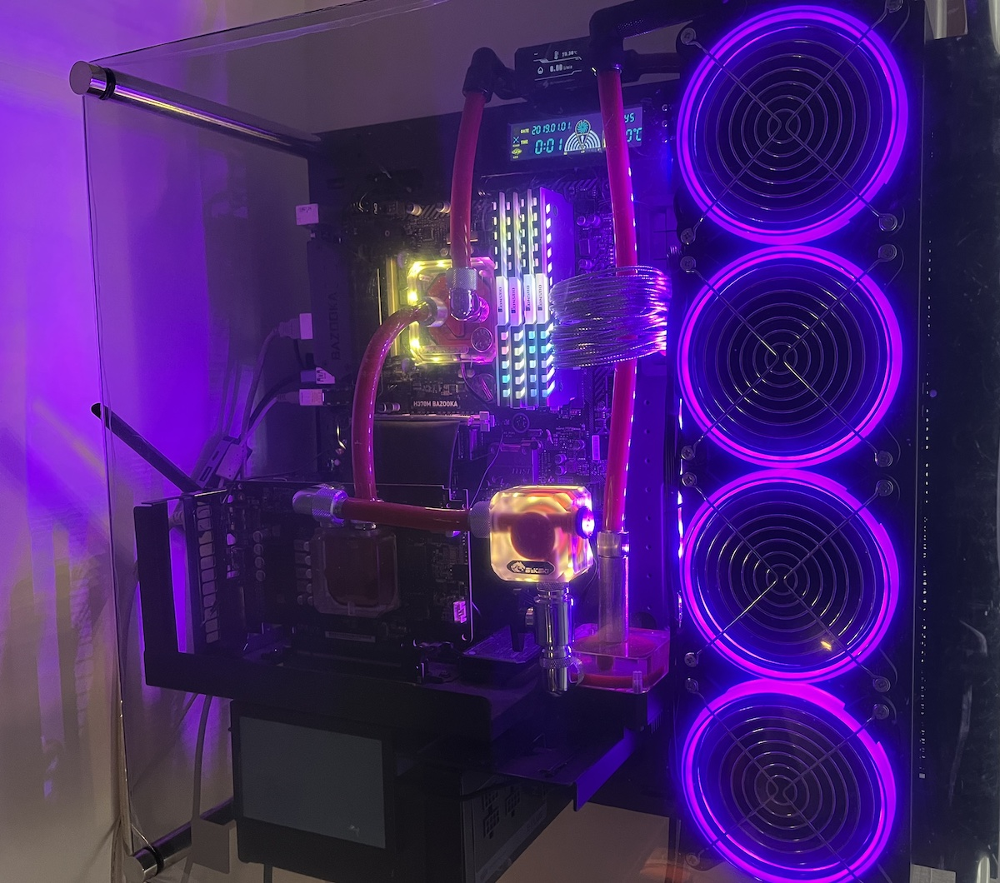
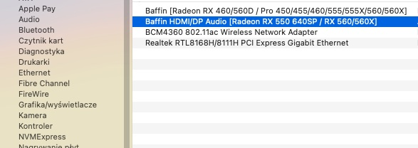
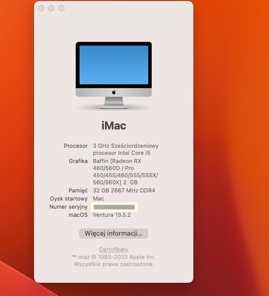
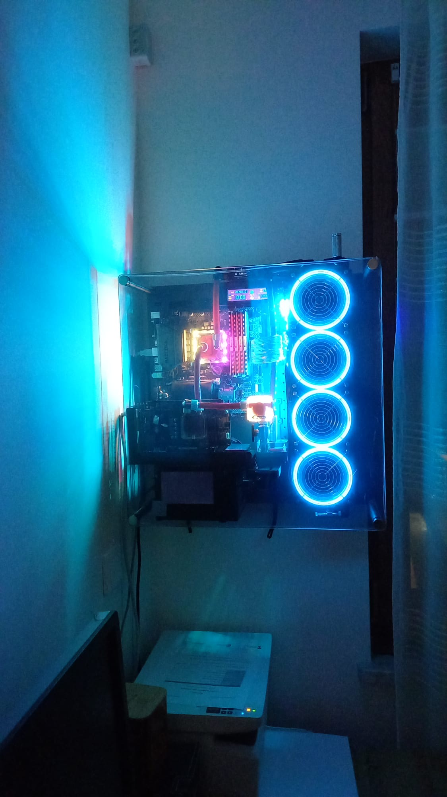

# H370 Bazooka Water Cooling Hackintosh

I built an open-frame water-cooling wall desktop on a Thermaltake Core P3 case, mainly for decorative and aesthetic purposes.

I use my computer for everyday work.  I am not a game player and  I do not need much computing power. Therefore, I used some parts of the old Hackintosh/Windows desktop (dualbooting) to upgrade the system to Ventura and the bootloader to OpenCore.

Windows were installed on the first partition of the disk, and MacOS was installed on the second partition according to Dortania's guide [Dortania](https://dortania.github.io/OpenCore-Install-Guide/)

I used EFI and settings were based on ideas of DERBALKON project for MSI B360M  (please refer to the details: https://github.com/derbalkon/B360M-CoffeeLake-Hackintosh THANK YOU!)

MacOS was installed without any problems. I introduced a boot menu in the config.plist to enable DualBooting. OpenCore starts from USB.

|                |                                                   |
| ------------: | :------------------------------------------------- |
|         Board | MSI® H370M Bazooka                                 |
|           CPU | Intel® Core™ i5-8500                               |
|        Memory | Corsair 4 x 8GB (DDR4 2666MHz)                     |
|           SSD | Adata SX8200PNP  M.2 256GB                         |
|      Graphic  | Asus Radeon™ RX460 2GB x8                          |
|     Wireless  | Broadcom® BCM4360 AliExpress (with Bluetooth 4.0)  |
|      Monitor  | Dell U2412M 1920 x 1200                            |
|         Case  | Thermaltake Core P3 Pro                            |
|     Radiator  | Thermaltake Pacific CL480                          |
| Power supply  | SilentiumPC Supremo Gold 550W                      |                          

I adapted the system to my hardware:

### Kexts 
  - ` RealtekRTL8111.kext ` :Ethernet 1GB [ MiezeRTL8111 ](https://github.com/Mieze/RTL8111_driver_for_OS_X/releases).
  -  ` USBMap.kext `  :I mapped the USB following the guide at: https://github.com/corpnewt/USBMap. I did not manage to map the  USB3 port MB to the front panel, as my MB has a damaged slot.
     
### config.plist 
- DeviceProperties -> layout.id -> 87 (for audio codec Realtek ALC887 ).

- Other PCI entries for the Raedon RX 460 audio decoder, Wifi/BT Broadcom BCM4360, LAN Realtek RTL8111H, were detected by OpenCore Configurator (be careful, this tool seems easy to use, but it can mess up). 

  
- SMBIOS iMac 19.2
  

## What is not working:

PowerOff via on/off button front panel - I don't know how to fix it
The waking up  only works via the on/off front panel - but for me this is not a disadvantage because the fans do not turn on when the keyboard and mouse are hit.

 ## What is working:
Everything apart from above, INCLUDING APPLE MUSIC AND APPLE TV!!!! 
There are no DRM problems

## Credit
- **Derbalkon** [B360M-CoffeeLake-Hackintosh](https://github.com/derbalkon/B360M-CoffeeLake-Hackintosh)
- **Acidanthera**'s [OpenCore Respository](https://github.com/acidanthera/OpenCorePkg)
- **Installation Guide** from [Dortania](https://dortania.github.io/OpenCore-Install-Guide/)
- **Mieze** [ RealtekRTL8111.kext ](https://github.com/Mieze/RTL8111_driver_for_OS_X/releases)
- **OpenCore Configurator** [Mackie`s Project] (https://mackie100projects.altervista.org/opencore-configurator/)

